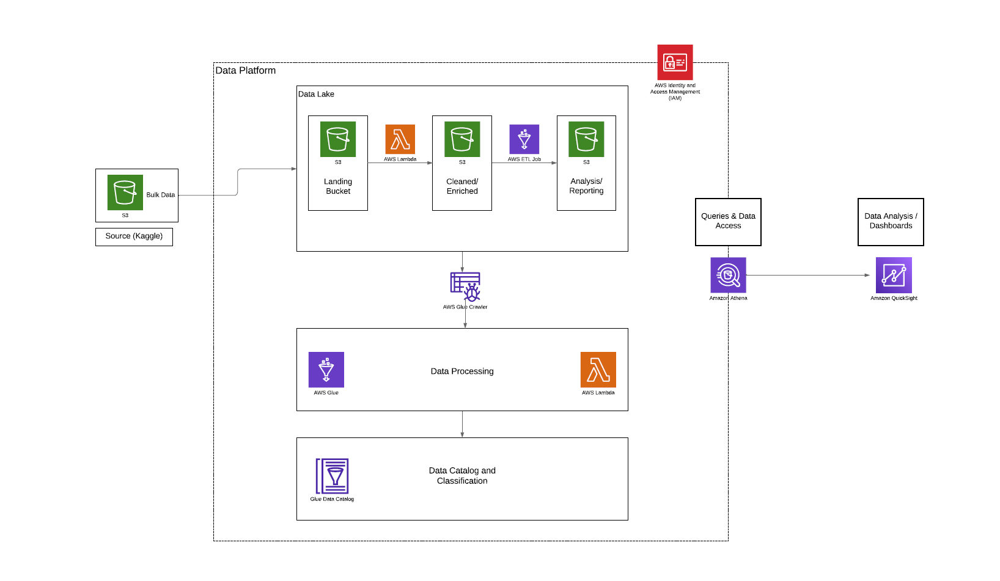
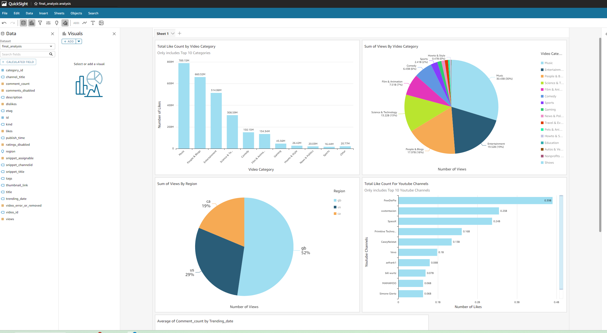

# Youtube Data Engineering Project

## Overview
This GitHub repository contains the code and configuration for a data engineering project that aims to securely manage, streamline, and perform analysis on structured and semi-structured YouTube video data based on video categories and trending metrics.

## Project Goals
1. Data Ingestion - Build a mechanism to ingest data from different sources.
2. ETL System: Transform raw data into the proper format.
3. Data Lake: Create a centralized repository (S3 Bucket) to store data from multiple sources.
4. Scalability: Ensure the system scales with increasing data size.
5. Cloud Compute: Utilize AWS for processing vast amounts of data.
6. Reporting: Build a dashboard to extract insights from the processed data.

## Serivces Used
### 1. AWS IAM (Identity and Access Management):
   - Manage access by creating a user with AdministratorAccess, enabling access keys and console access, and logging in via AWS CLI.
### 2. Amazon S3 (Simple Storage Service):
   - Create an S3 Bucket for raw data, upload JSON and CSV files, serving as storage for raw statistics.
### 3. AWS Glue:
   - Set up IAM role for Glue Crawler, extract data from S3 using Glue Crawler, and transform CSV to Parquet with ETL Job.
### 4. Amazon Athena:
   - Utilize Athena to view data from Glue catalog tables and configure settings for query result storage in an S3 bucket.
### 5. AWS Lambda:
   - Develop a Lambda function in Python 3.8 for cleaning and transforming data into Parquet, triggered by new information in the raw S3 bucket.
### 6. AWS Glue Studio:
   - Use Glue Studio to create an ETL pipeline, performing an inner join transformation on data sources and storing results in a new S3 bucket.
### 7. AWS QuickSight:
   - Sign up for QuickSight, create a DataSource using Athena to connect with ETL-created database, and build a sample dashboard.

## Pre-Rec Setup
1. Create [AWS Account](https://repost.aws/knowledge-center/create-and-activate-aws-account) - Set default AZ to North Virginia (us-east-1).
2. Download and Set Up [AWS CLI](https://aws.amazon.com/cli/): Install AWS CLI and configure it. 
3. Download Kaggle YouTube Data - Download the [Kaggle YouTube data](https://www.kaggle.com/datasets/datasnaek/youtube-new) and place it in a dedicated project folder.

## Architecture Diagram

## Part 1: Create IAM Account for Project
1. Create IAM User:
    - Create a user with access key and console access, attach AdministratorAccess policy.
2. Download Access Key:
    - Store access key information.
3. Login to IAM User Account:
    - Use AWS CLI to log in.

## Part 2: Create S3 Bucket and Upload Data
1. Create S3 Bucket:
    - Create an S3 bucket (dataeng-on-youtube-raw-dev) with default settings.
2. Upload Data to S3 Bucket:
    - Use AWS CLI to upload JSON and CSV files to the S3 bucket.

## Part 3: Create Glue Crawler
1. Create IAM Role for Glue Crawler:
    - Create a role with AmazonS3FullAccess and AWSGlueServiceRole policies.
2. Create and Run Crawler:
    - Use AWS Glue to create a crawler for raw data, extracting database and table information.

## Part 4: Setup Athena Job
1. View Data in Athena:
    - Access the Glue catalog table, view data, and configure Athena settings.
2. Create Athena Result Bucket:
    - Create a new S3 bucket for Athena query results.

## Part 5: Create Lambda Function to Clean Data
1. Create Lambda Function:
    - Use AWS Lambda to deploy a Python script for data cleaning.
2. Configure Environment Variables:
    - Set up variables for Glue catalog, S3 locations, and data operation.
3. Create Lambda Layer:
    - Use AWS Layers to create a layer for AWS SDK Pandas.
4. Run Test Case:
    - Create and run a test case to ensure data is processed and stored.

## Part 6: Query, Crawl, and Process Data
1. Query Athena Data:
    - Run queries on cleaned data using Athena.
2. Create Glue Crawlers for Raw CSV Region Data:
    - Create and run crawlers for raw CSV data, partitioned by region.
3. Create Glue ETL Job:
    - Set up Glue ETL job to transform CSV files to Parquet format.
4. Update PySpark Script:
    - Import Dynamic Frame, filter English-speaking regions, and adjust job settings.
5. Create Glue Crawler for Cleaned Data:
    - Create and run a crawler for cleaned data, partitioned by region.

## Part 7: Create ETL Pipeline for Reporting
1. Create Glue Studio Job:
    - Use Glue Studio to create a job with two source S3 buckets and an inner join transformation.
2. Create Target S3 Bucket:
    - Set up a new S3 bucket for the final analysis.
  

3. Save and Run Job:
    - Save and execute the Glue Studio job for reporting purposes.
    
## Part 7: Create Simple Dashboard with AWS QuickSight
1. Sign up for a Standard QuickSight Account.
2. Create a new DataSource using Athena.
3. Connect to the database and table created during ETL.
4. Build a sample dashboard using the final cleaned data.

## Final Output Dashboard

